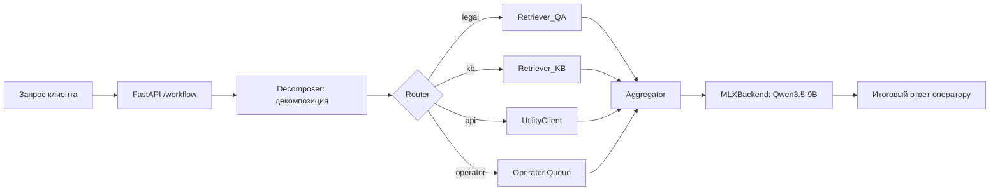

# EnSB+ Support AI — RAG-система с агентами (OTUS MLOps Diploma)

Референсная реализация пайплайна оператор-ассистента на базе RAG с архитектурой на графах (LangGraph) для Linux + GPU/MLX.



---

## 📋 Возможности

| Компонент | Описание |
|-----------|----------|
| **LLM-инференс** | `mlx-lm` с `mlx-community/Qwen3.5-9B-MLX-4bit` (Apple Silicon) или vLLM-совместимый бэкенд |
| **Векторная БД** | `Qdrant` с поддержкой dense (BGE-M3) и sparse (BM25) индексов |
| **Режимы поиска** | `semantic`, `hybrid`, `semantic_rerank`, `hybrid_rerank` (RRF + BAAI reranker) |
| **Оркестрация** | `LangGraph` с состояниями: декомпозиция → маршрутизация → обработка → агрегация |
| **API** | `FastAPI` с эндпоинтами `/health`, `/retrieve_QA`, `/workflow` |
| **Мониторинг** | Интеграция с `Langfuse` для трассировки и отладки цепочек |
| **Метрики** | `Recall@K`, `MRR@10`, `% валидного JSON` (через eval-скрипты) |

---

## 🗂 Структура проекта

```
.
├── config/
│   └── config.py              # Настройки через .env (Qdrant, модели, параметры LLM)
├── data/
│   └── processed/             # Корпусы: corpus_QA.jsonl, corpus_KB.jsonl, eval.jsonl
├── graph/
│   ├── builder.py             # Сборка LangGraph-воркфлоу
│   ├── nodes.py               # Ноды: decomposer, process_item, aggregator
│   └── routing.py             # Логика маршрутизации между нодами
├── llm/
│   ├── base.py                # Абстрактный интерфейс LLM-бэкенда
│   └── mlx_backend.py         # Реализация для mlx-lm (Apple Silicon)
├── models/
│   └── schemas.py             # Pydantic/LangChain схемы: WorkflowState, SubQuery, RetrievedDoc
├── script/                    # Вспомогательные утилиты (опционально)
├── src/
│   ├── api.py                 # FastAPI-эндпоинты
│   ├── embeddings.py          # Encoders: BGE-M3 для dense-векторов
│   ├── io_utils.py            # Утилиты чтения/записи JSONL
│   ├── prompts.py             # Системные промпты для Decomposer/Aggregator
│   ├── reranker.py            # BAAI/bge-reranker-v2-m3 для post-retrieval reranking
│   ├── retrieval_KB.py        # Retriever для справочной базы знаний
│   ├── retrieval_QA.py        # Retriever для FAQ/юридических шаблонов
│   └── api_system.py          # Клиент для внешних API (биллинг, CRM)
├── docker-compose.yaml        # Сервисы: Qdrant (опционально: Ollama)
├── pyproject.toml             # Зависимости: uv, Python 3.12+
├── run.py                     # Точка входа для CLI-запросов
└── README.md                  # Этот файл
```

---

## 🚀 Быстрый старт

### Предварительные требования

- **ОС**: Linux / macOS (Apple Silicon для MLX) / Windows с WSL2
- **GPU**: NVIDIA CUDA (для reranker) **или** Apple M1/M2/M3 (для mlx-lm)
- **Python**: 3.12+, менеджер пакетов [`uv`](https://github.com/astral-sh/uv)
- **Docker**: для запуска Qdrant (опционально, если используется локальный инстанс)


### Установка

```bash
# 1. Клонировать репозиторий
git clone https://github.com/rpallmer/OTUS_MLOPS_DIPLOM.git
cd OTUS_MLOPS_DIPLOM

# 2. Настроить окружение
cp .env.example .env  # Отредактируйте под ваши пути и модели
uv sync

# 3. Запустить зависимости (только Qdrant)
docker compose up -d qdrant

# 4. Подготовить данные (пример: 1000 QA-пар + 100 eval-запросов)
uv run scripts/prepare_data.py  # или make prepare-data при наличии Makefile
```

### Запуск API-сервера

```bash
uv run uvicorn src.api:app --host 0.0.0.0 --port 8080 --reload
```

Проверка здоровья:
```bash
curl http://localhost:8080/health
# → {"status":"ok"}
```

## 📡 API usage examples

### Retrieve (поиск документов)

```bash
curl -s -X POST http://localhost:8080/retrieve_QA \
  -H "Content-Type: application/json" \
  -d '{
    "query": "Как погасить задолженность по кредиту?",
    "col_name": "QA_ES",
    "mode": "hybrid_rerank",
    "top_k": 5
  }' | jq
```

### Workflow (сквозной запрос с декомпозицией и генерацией)

```bash
curl -s -X POST http://localhost:8080/workflow \
  -H "Content-Type: application/json" \
  -d '{
    "query": "Я переехал, как переоформить лицевой счёт и расторгнуть договор?",
    "crm_ticket": "CRM-2024-0451",
    "trace_id": "trace-abc123"
  }' | jq
```

**Ответ WorkflowResponse:**
```json
{
  "status": "completed",
  "final_response": "Для переоформления лицевого счёта после переезда...",
  "errors": [],
  "thread_id": "CRM-2024-0451",
  "decomposed_count": 3
}
```

---

## ⚙️ Configuration (.env)

```ini
# Qdrant
QDRANT_URL=http://localhost:6333
COLLECTION_NAME_QA=QA_ES
COLLECTION_NAME_KB=KB_ES

# Данные
DATA_CORPUS_QA_PATH=data/processed/corpus_QA.jsonl
DATA_CORPUS_KB_PATH=data/processed/corpus_KB.jsonl
DATA_EVAL_PATH=data/processed/eval.jsonl

# Модели
DENSE_MODEL=models/BAAI--bge-m3
RERANKER_MODEL=models/bge-reranker-v2-m3
RERANK_CANDIDATES=30
LLM_MODEL=mlx-community/Qwen3.5-9B-MLX-4bit

# LLM-параметры
VLLM_BASE_URL=http://localhost:8000/v1
LLM_TEMPERATURE=0.1
LLM_MAX_TOKENS=512

# Мониторинг
LANGFUSE_PUBLIC_KEY=pk-lf-...
LANGFUSE_SECRET_KEY=sk-lf-...
LANGFUSE_HOST=https://cloud.langfuse.com
```

---

## 🧭 Архитектурные решения

### 1. Гибридный ретривал с RRF
- **Dense**: BGE-M3 для семантического поиска
- **Sparse**: BM25 для лексического перекрытия
- **Fusion**: Reciprocal Rank Fusion с коэффициентом 60
- **Rerank**: BAAI/bge-reranker-v2-m3 для финальной сортировки топ-K

### 2. LangGraph-оркестрация
```python
WorkflowState:
  original_query → decomposer → [sub_query × N] 
    → router → process_item (цикл) → aggregator → final_response
```
- **Decomposer**: LLM-декомпозиция сложного запроса на под-задачи с извлечением сущностей
- **Router**: Динамическая маршрутизация по `routing_target` (legal/KB/API/operator)
- **Aggregator**: Сборка финального ответа с учётом статуса каждого под-запроса

### 3. Model-swappable дизайн
- Абстракция `BaseLLMBackend` позволяет заменить MLX на vLLM, Ollama или OpenAI-совместимый эндпоинт
- Все модели и пути вынесены в `.env` — перезапуск eval после смены модели не требует изменения кода

---

## ⚠️ Ограничения и рекомендации

| Аспект | Статус | Комментарий |
|--------|--------|-------------|
| **Аппаратные требования** | 🔋 MLX: Apple Silicon / 🔥 CUDA: reranker | При нехватке VRAM reranker автоматически переключается на CPU (с замедлением) |
| **Масштабирование** | 🧪 Эксперимент | Код оптимизирован для воспроизводимости, а не для high-load; для продакшена добавить: кэширование, rate-limiting, health-checks |
| **Безопасность** | 🔐 Базовая | Нет аутентификации в API; добавить JWT/OAuth перед деплоем |

---
